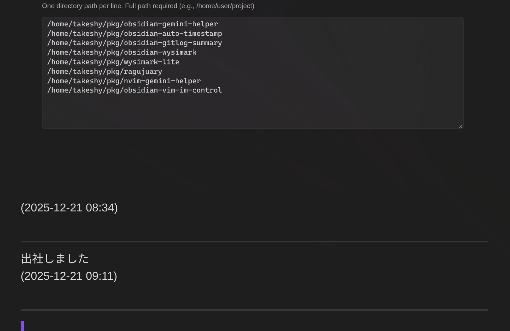
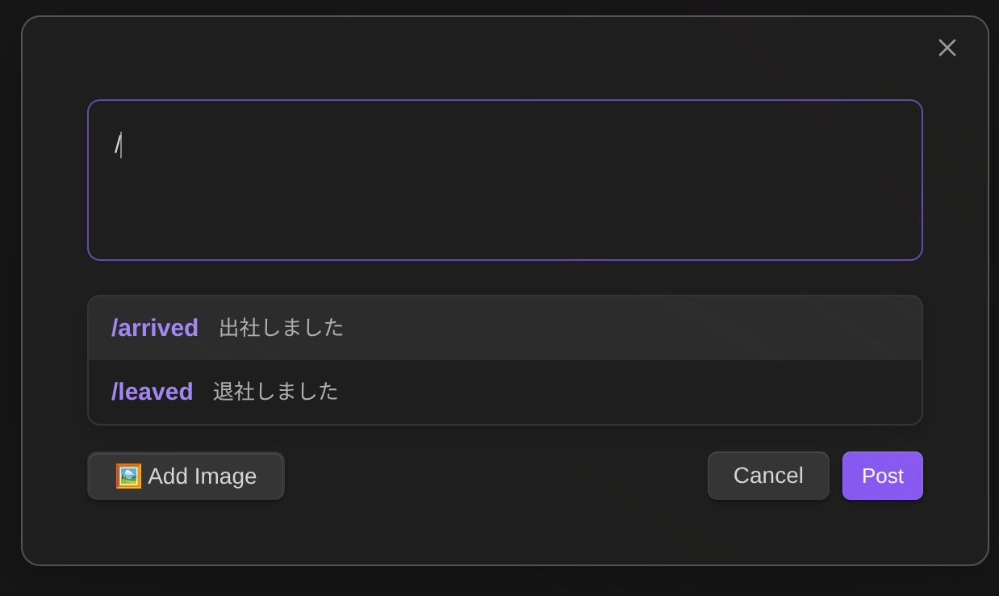
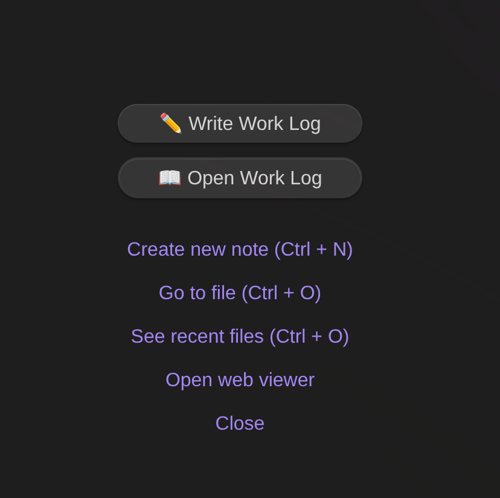
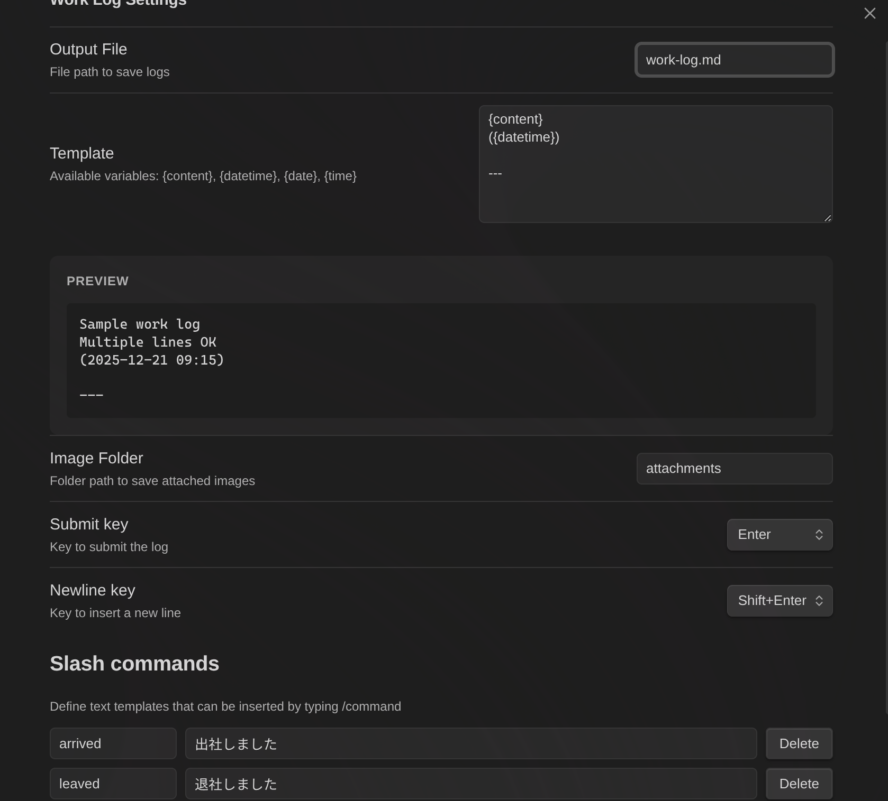

# Work Log for Obsidian

A simple Obsidian plugin to quickly write and save work logs with timestamps.

## Features

- **Quick Entry Modal** - Press a hotkey or click the ribbon icon to open a modal for quick log entries
- **Home View** - A dedicated view with a button to create new log entries
- **Customizable Templates** - Configure the output format using template variables
- **Auto File Creation** - Automatically creates the log file and folders if they don't exist

## Template Variables

- `{content}` - Your log entry text
- `{datetime}` - Full date and time (YYYY-MM-DD HH:mm)
- `{date}` - Date only (YYYY-MM-DD)
- `{time}` - Time only (HH:mm)

## Default Template

```
{content}
({datetime})

---
```

## Output Example



## Installation

### Manual Installation
1. Download the latest release (`main.js`, `manifest.json`, `styles.css`)
2. Create a folder `work-log` in your vault's `.obsidian/plugins/` directory
3. Copy the downloaded files into the folder
4. Enable the plugin in Obsidian Settings > Community Plugins

### From Source
```bash
git clone https://github.com/takeshy/obsidian-work-log
cd obsidian-work-log
npm install
npm run build
```

Copy `main.js`, `manifest.json`, and `styles.css` to your vault's plugin folder.

## Usage

### Using the Command
1. Open the command palette (`Ctrl/Cmd + P`)
2. Search for "Work Log: Write Work Log"
3. Enter your log and press Enter or click "Post"



### Using the Ribbon Icon
Click the pencil icon in the left ribbon to open the log entry modal.

### Using the New Tab View
When you open a new tab, buttons for writing and opening work logs are displayed.



## Settings



- **Output File** - The file path where logs are saved (default: `work-log.md`)
- **Template** - Customize the log entry format using template variables
- **Image Folder** - Folder path to save attached images
- **Submit Key** - Key to submit the log (Enter, Shift+Enter, Ctrl+Enter, Alt+Enter)
- **Newline Key** - Key to insert a new line
- **Slash Commands** - Define text templates that can be inserted by typing /command

## Development

```bash
# Install dependencies
npm install

# Development build (watch mode)
npm run dev

# Production build
npm run build

# Lint
npm run lint
```

## Requirements

- Obsidian v1.0.0 or higher
- Works on both desktop and mobile

## License

MIT
